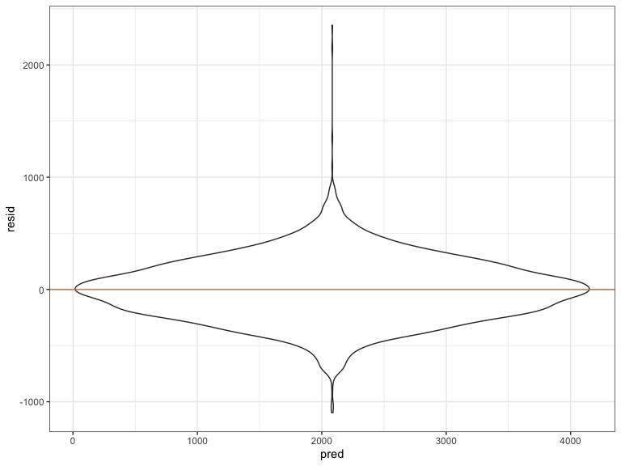
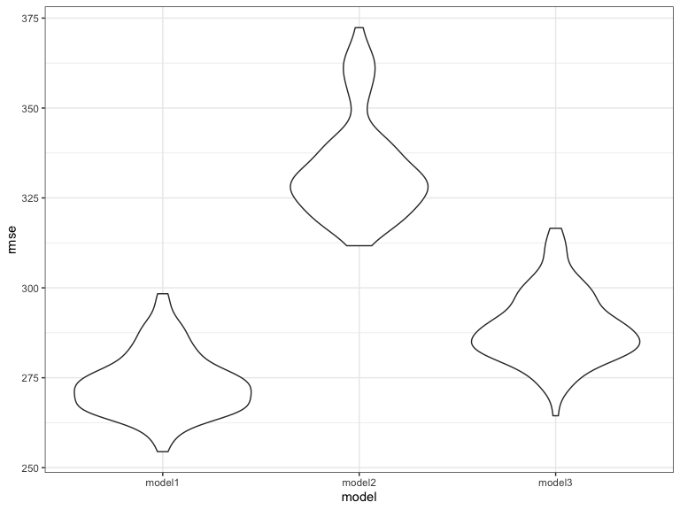

p8105\_hw6\_LG2982
================
Lizbeth Gomez
11/22/2019

``` r
library(tidyverse)
```

    ## ── Attaching packages ───────────────────────────────────────────────────────────────────────────────── tidyverse 1.2.1 ──

    ## ✔ ggplot2 3.2.1     ✔ purrr   0.3.3
    ## ✔ tibble  2.1.3     ✔ dplyr   0.8.3
    ## ✔ tidyr   1.0.0     ✔ stringr 1.4.0
    ## ✔ readr   1.3.1     ✔ forcats 0.4.0

    ## ── Conflicts ──────────────────────────────────────────────────────────────────────────────────── tidyverse_conflicts() ──
    ## ✖ dplyr::filter() masks stats::filter()
    ## ✖ dplyr::lag()    masks stats::lag()

``` r
library(modelr)
library(mgcv)
```

    ## Loading required package: nlme

    ## 
    ## Attaching package: 'nlme'

    ## The following object is masked from 'package:dplyr':
    ## 
    ##     collapse

    ## This is mgcv 1.8-28. For overview type 'help("mgcv-package")'.

``` r
knitr::opts_chunk$set(
    echo = TRUE,
    warning = FALSE,
    fig.width = 8, 
  fig.height = 6,
  out.width = "90%"
)
options(
  ggplot2.continuous.colour = "viridis",
  ggplot2.continuous.fill = "viridis"
)
scale_colour_discrete = scale_colour_viridis_d
scale_fill_discrete = scale_fill_viridis_d
theme_set(theme_bw() + theme(legend.position = "bottom"))
```

# Problem 1:

  - Load and clean the data for regression analysis:

<!-- end list -->

``` r
birth = read_csv("./data/birthweight.csv") %>% 
  mutate(babysex = recode(babysex, 
                          "1" = "Male",
                          "2" = "Female"),
         fincome = fincome * 100,
         frace = recode(frace,
                        "1" = "White",
                        "2" = "Black",
                        "3" = "Asian",
                        "4" = "Puetro Rican",
                        "8" = "Other",
                        "9" = "Unknown"),
         malform = recode(malform, 
                          "0" = "Yes",
                          "1" = "No"
                          ),
         mrace = recode(mrace,
                        "1" = "White",
                        "2" = "Black",
                        "3" = "Asian",
                        "4" = "Puetro Rican",
                        "8" = "Other")
         ) 
```

    ## Parsed with column specification:
    ## cols(
    ##   .default = col_double()
    ## )

    ## See spec(...) for full column specifications.

``` r
sum(is.na(birth))
```

    ## [1] 0

*There are no missing values in this dataset*

  - Propose a regression model for birthweight. To start, I will look at
    all variables that are known to underly birthweight
outcomes.

<!-- end list -->

``` r
model_1 = lm(bwt ~ babysex + bhead + blength + delwt + fincome + gaweeks + mheight + mrace + parity + ppwt + smoken, data = birth) 

summary(model_1)
```

    ## 
    ## Call:
    ## lm(formula = bwt ~ babysex + bhead + blength + delwt + fincome + 
    ##     gaweeks + mheight + mrace + parity + ppwt + smoken, data = birth)
    ## 
    ## Residuals:
    ##      Min       1Q   Median       3Q      Max 
    ## -1097.18  -185.52    -3.39   174.14  2353.44 
    ## 
    ## Coefficients:
    ##                     Estimate Std. Error t value Pr(>|t|)    
    ## (Intercept)       -6.145e+03  1.419e+02 -43.291  < 2e-16 ***
    ## babysexMale       -2.856e+01  8.455e+00  -3.378 0.000737 ***
    ## bhead              1.308e+02  3.447e+00  37.944  < 2e-16 ***
    ## blength            7.495e+01  2.019e+00  37.120  < 2e-16 ***
    ## delwt              4.107e+00  3.921e-01  10.475  < 2e-16 ***
    ## fincome            3.180e-03  1.747e-03   1.820 0.068844 .  
    ## gaweeks            1.159e+01  1.462e+00   7.929 2.79e-15 ***
    ## mheight            6.594e+00  1.785e+00   3.694 0.000223 ***
    ## mraceBlack        -6.391e+01  4.237e+01  -1.508 0.131523    
    ## mracePuetro Rican -2.579e+01  4.535e+01  -0.569 0.569578    
    ## mraceWhite         7.489e+01  4.231e+01   1.770 0.076837 .  
    ## parity             9.630e+01  4.034e+01   2.388 0.017004 *  
    ## ppwt              -2.676e+00  4.274e-01  -6.261 4.20e-10 ***
    ## smoken            -4.843e+00  5.856e-01  -8.271  < 2e-16 ***
    ## ---
    ## Signif. codes:  0 '***' 0.001 '**' 0.01 '*' 0.05 '.' 0.1 ' ' 1
    ## 
    ## Residual standard error: 272.3 on 4328 degrees of freedom
    ## Multiple R-squared:  0.7181, Adjusted R-squared:  0.7173 
    ## F-statistic: 848.1 on 13 and 4328 DF,  p-value: < 2.2e-16

``` r
birth %>%
  modelr::add_residuals(model_1) %>%
  modelr::add_predictions(model_1) %>%
  ggplot(aes(x = pred, y = resid)) +
  geom_violin() +
  geom_hline(yintercept = 0, color = "peru")
```



*As shown in this plot of residuals versus predicted values, there is
reasonable cosntant variace in the data as most of the observations fall
fall around 0. (the very low and very high observations can be
outliers)*

  - Comparison models:

<!-- end list -->

``` r
model_2 = lm(bwt ~ blength + gaweeks, data = birth)
model_3 = lm(bwt ~ (bhead + blength + babysex)^3, data = birth)
```

``` r
crossv_mc(birth, 100)  %>% 
  mutate(
    train = map(train, as_tibble),
    test = map(test, as_tibble)) %>% 
    mutate(model_1  = map(train, 
                     ~lm(bwt ~ babysex + bhead + blength + delwt + fincome + 
                           gaweeks + mheight + mrace + parity + ppwt + smoken, data = .x)),
         
         model_2  = map(train, ~lm(bwt ~ blength + gaweeks, data = .x)),
         
         model_3 = map(train, ~lm(bwt ~ (bhead + blength + babysex)^3, data = .x))
         )%>%
  mutate(rmse_model1 = map2_dbl(model_1, test, ~rmse(model = .x, data = .y)),
         rmse_model2 = map2_dbl(model_2, test, ~rmse(model = .x, data = .y)),
         rmse_model3 = map2_dbl(model_3, test, ~rmse(model = .x, data = .y))) %>%
    select(starts_with("rmse")) %>% 
  pivot_longer(
      everything(),
      names_to = "model", 
      values_to = "rmse",
      names_prefix = "rmse_") %>% 
    mutate(model = fct_inorder(model)) %>% 
    ggplot(aes(x = model, y = rmse)) +
  geom_violin()
```



*Based on the plot, we see that model 1 has the lowest RMSE, so we
conclude that it fits the data better than model 2 and model 3*

# Problem 2:

  - Load and clean data

<!-- end list -->

``` r
weather_df = 
  rnoaa::meteo_pull_monitors(
    c("USW00094728"),
    var = c("PRCP", "TMIN", "TMAX"), 
    date_min = "2017-01-01",
    date_max = "2017-12-31") %>%
  mutate(
    name = recode(id, USW00094728 = "CentralPark_NY"),
    tmin = tmin / 10,
    tmax = tmax / 10) %>%
  select(name, id, everything())
```

    ## Registered S3 method overwritten by 'crul':
    ##   method                 from
    ##   as.character.form_file httr

    ## Registered S3 method overwritten by 'hoardr':
    ##   method           from
    ##   print.cache_info httr

    ## file path:          /Users/lizbethgomez/Library/Caches/rnoaa/ghcnd/USW00094728.dly

    ## file last updated:  2019-09-26 10:36:26

    ## file min/max dates: 1869-01-01 / 2019-09-30

``` r
boot_sample = function(df) {
  sample_frac(df, replace = TRUE)
}

boots = data_frame(
  strap_number = 1:5000,
  strap_sample = rerun(5000, boot_sample(weather_df))
)

boots_results = boots %>%
  mutate(models = map(strap_sample, ~lm(tmax ~ tmin, data = .x)),
         results_glance =  map(models, broom::glance),
         result_tidy = map(models, broom::tidy)
         ) %>%
  select(-strap_sample, -models) %>%
  unnest() %>%
  select(strap_number, r.squared, term, estimate) %>%
  pivot_wider(names_from = "term",
              values_from = "estimate") %>%
  janitor::clean_names() %>%
  mutate(logB = log(intercept * tmin))
  

boots_results %>%
  summarise("R^2" = mean(r_squared),
            "Log(B0 * B1)" = mean(logB)) %>%
  knitr::kable(digits = 3)
```

|   R^2 | Log(B0 \* B1) |
| ----: | ------------: |
| 0.912 |         2.013 |

``` r
r_squared= boots_results %>%
  ggplot(aes(x = r_squared)) +
  geom_histogram(alpha = 0.6, color = "peru") +
  xlab("R^2 estimate") 


log= boots_results %>%
  ggplot(aes(x = logB)) +
  geom_histogram(alpha = 0.6, color = "peru") +
  xlab("Log of Parameter")
```

*These histograms above show that the distributions of our R squared and
log parameter product estimates are normally distributed around 0.912
and 2.013, respectively*

  - Identify quantieles:

<!-- end list -->

``` r
quantile(pull(boots_results, r_squared), probs = c(.025, .975)) %>% 
    knitr::kable(digits = 3)
```

|       |     x |
| ----- | ----: |
| 2.5%  | 0.894 |
| 97.5% | 0.927 |

``` r
quantile(pull(boots_results, logB), probs = c(.025, .975)) %>% 
    knitr::kable(digits = 3)
```

|       |     x |
| ----- | ----: |
| 2.5%  | 1.965 |
| 97.5% | 2.060 |

*2.5% and 97.5% quantiles shown above*
